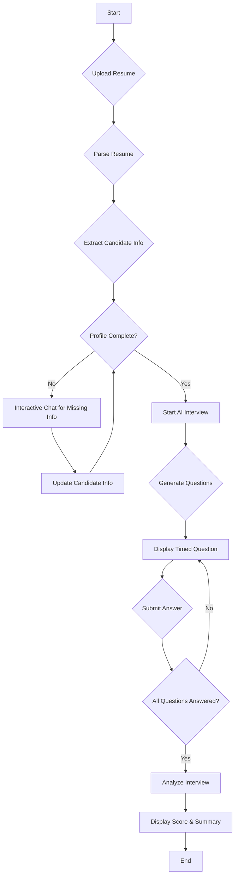
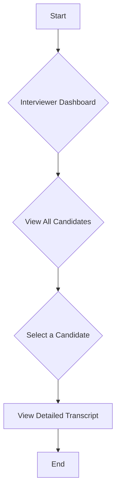

# AI Interview Assistant

Welcome to the AI Interview Assistant, a web application designed to streamline the initial stages of the technical interview process. This tool automates resume parsing, conducts an AI-powered interview with candidates, and provides insightful analysis for interviewers. The application is built with Next.js and leverages the power of Google's Gemini AI for generating interview questions and analyzing responses.

## ✨ Key Features

  * **📄 Resume Parsing**: Automatically extracts key information like name, email, and phone number from uploaded resumes (PDF and DOCX formats).
  * **🤖 AI-Powered Interviews**: Conducts automated, timed interviews with candidates using questions generated by a large language model.
  * **📊 Performance Analysis**: Provides a score and a concise summary of the candidate's performance based on their answers.
  * **👨‍💼 Interviewer Dashboard**: A centralized dashboard for interviewers to view all candidate submissions, scores, and summaries.
  * \*\* resumes\_to\_be\_read interviewer/:id\*\* Detailed view of each candidate's interview, including the full transcript.
  * **🔐 Client-Side State Management**: Utilizes Zustand for robust and persistent state management, allowing candidates to resume interrupted interviews.

-----

## 🚀 Technology Stack

This project is built with a modern, full-stack JavaScript technology stack:

  * **Framework**: [Next.js](https://nextjs.org/) (with Turbopack)
  * **Styling**: [Tailwind CSS](https://tailwindcss.com/)
  * **UI Components**: [Ant Design](https://ant.design/)
  * **State Management**: [Zustand](https://github.com/pmndrs/zustand)
  * **AI Integration**: [Google Generative AI (Gemini)](https://ai.google.dev/)
  * **File Parsing**: [pdf-parse](https://www.npmjs.com/package/pdf-parse), [mammoth](https://www.npmjs.com/package/mammoth)
  * **Containerization**: [Docker](https://www.docker.com/)

-----

## 📂 Project Structure

The project follows a standard Next.js `app` directory structure:

```

.
├── public/
├── src/
│   ├── app/
│   │   ├── api/
│   │   │   ├── analyze-interview/
│   │   │   ├── generate-interview/
│   │   │   └── upload/
│   │   ├── interviewee/
│   │   ├── interviewer/
│   │   │   ├── [id]/
│   │   └── layout.js
│   ├── components/
│   │   ├── CandidateInfo.jsx
│   │   ├── Chat.jsx
│   │   ├── FileUpolad.jsx
│   │   ├── InterviewView.jsx
│   │   ├── Navbar.jsx
│   │   ├── Timer.jsx
│   │   └── WelcomeBackModal.jsx
│   ├── store/
│   │   └── candidateStore.js
│   └── utils/
│       └── textParser.js
├── .dockerignore
├── Dockerfile
├── .gitignore
├── eslint.config.mjs
├── next.config.mjs
├── package.json
└── README.md

```

-----

## ⚙️ Setup and Installation

To get a local copy up and running, follow these simple steps.

### Prerequisites

  * Node.js (v18.18.0 or later)
  * npm, yarn, or pnpm
  * Docker (for containerized deployment)

### Installation

1.  **Clone the repository:**

    ```bash
    git clone [https://github.com/jitendra2407/swipe_assignment.git](https://github.com/jitendra2407/swipe_assignment.git)
    ```

2.  **Navigate to the project directory:**

    ```bash
    cd swipe_assignment
    ```

3.  **Install dependencies:**

    ```bash
    npm install
    ```

4.  **Set up environment variables:**

    Create a `.env.local` file in the root of your project and add your Google Gemini API key:

    ```
    GEMINI_API_KEY=YOUR_API_KEY
    ```

5.  **Run the development server:**

    ```bash
    npm run dev
    ```

Open [http://localhost:3000](https://www.google.com/search?q=http://localhost:3000) with your browser to see the result.

-----

## 🐳 Docker Deployment

This application is configured for Docker, allowing for easy containerization and deployment.

### Building the Docker Image

To build the Docker image, run the following command in the root of the project:

```bash
docker build -t ai-interview-assistant .
```

### Running the Docker Container

Once the image is built, you can run it as a container. You'll need to pass your Gemini API key as an environment variable.

```bash
docker run -p 3000:3000 -e GEMINI_API_KEY="YOUR_API_KEY" ai-interview-assistant
```

The application will be accessible at [http://localhost:3000](https://www.google.com/search?q=http://localhost:3000).

### Dockerfile Explained

The `Dockerfile` uses a multi-stage build to create a lean and efficient final image:

1.  **`deps` Stage**: Installs only the necessary dependencies to a `node_modules` directory.
2.  **`builder` Stage**: Copies the dependencies from the `deps` stage and then builds the Next.js application.
3.  **`runner` Stage**: This is the final, lightweight stage. It copies the built application from the `builder` stage and sets up a non-root user for security. It then exposes port 3000 and starts the application.

-----

## 🌊 Application Flow

The application is divided into two main user flows: the **Interviewee Flow** and the **Interviewer Flow**.

### Interviewee Flow

This is the primary flow for a candidate taking an interview.



### Interviewer Flow

This flow allows an interviewer to review the results of all completed interviews.



-----

## 🤖 API Endpoints

The application uses three API endpoints to handle the core logic:

  * **`POST /api/upload`**:

      * **Description**: Handles the upload of a candidate's resume.
      * **Request Body**: `FormData` with a `resume` field containing the file (PDF or DOCX).
      * **Response**: A JSON object containing the extracted candidate data and any validation warnings.

  * **`POST /api/generate-interview`**:

      * **Description**: Generates a set of interview questions using the Gemini AI.
      * **Request Body**: None.
      * **Response**: A JSON object containing an array of questions categorized by difficulty (easy, medium, hard).

  * **`POST /api/analyze-interview`**:

      * **Description**: Analyzes the candidate's answers and generates a score and summary.
      * **Request Body**: A JSON object with `questions` and `answers` arrays.
      * **Response**: A JSON object with the calculated `score` and a `summary` of the candidate's performance.

-----

## 🧠 State Management with Zustand

State management is handled by **Zustand**, a small, fast, and scalable state-management solution. The `candidateStore.js` file defines the store, which is structured to hold the state of the current interview session.

### State Structure

```javascript
{
  allCandidates: [], // Array of all completed interviews
  currentCandidate: {
    id: null,
    candidateData: { name: "", email: "", phone: "", rawText: "" },
    messages: [], // For the interactive chat
    interview: {
      questions: [],
      answers: [],
      currentQuestionIndex: 0,
      status: "idle", // idle, preparing, in-progress, completed
      score: 0,
      summary: ""
    }
  },
  isLoading: false,
  error: null
}
```

### Persistence

The state is persisted to `localStorage`, which allows a candidate to refresh the page or even close the browser and resume their interview from where they left off.

-----

## 🙏 Acknowledgements

  * This project was bootstrapped with [`create-next-app`](https://www.google.com/search?q=%5Bhttps://github.com/vercel/next.js/tree/canary/packages/create-next-app%5D\(https://github.com/vercel/next.js/tree/canary/packages/create-next-app\)).
  * The Geist font family was created by [Vercel](https://vercel.com/font).

<!-- end list -->

```
```